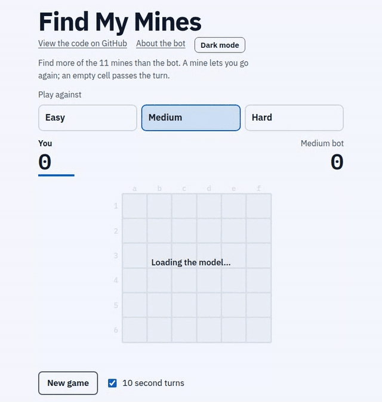
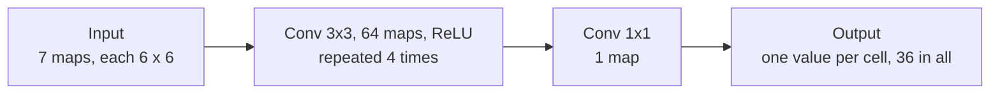
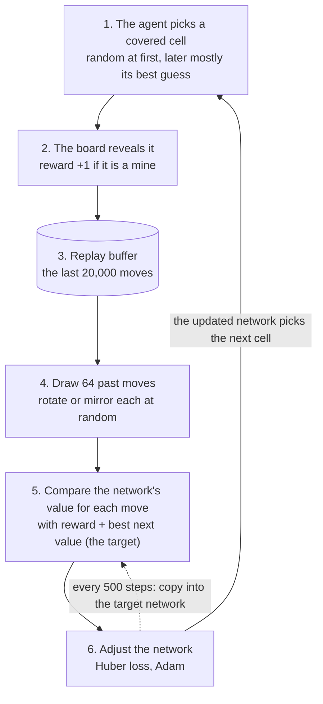
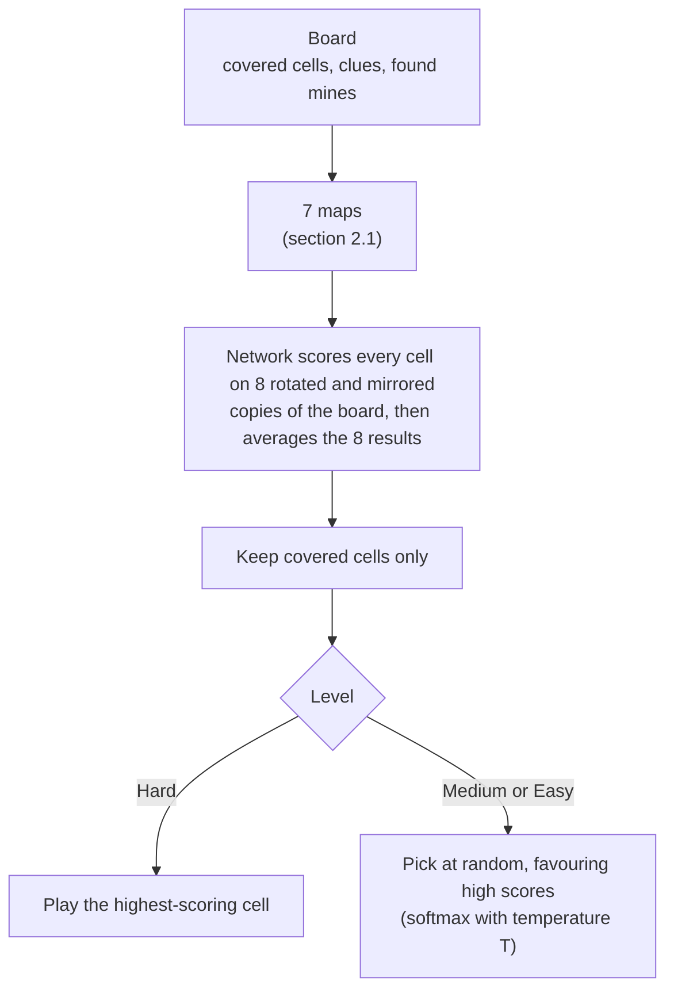

# Find My Mines: a Double DQN opponent that runs in the browser

A Double DQN agent, written from scratch in PyTorch, for a two-player 6×6 minefield. It runs in the browser at three difficulty levels.

**[Live demo](https://t6523.github.io/dqn-minesweeper-solver/)** · Reinforcement learning · Double DQN · PyTorch · ONNX · Convolutional Neural Network

<p align="center"></p>

## Highlights

- **0.47 turns behind an exact solver.** A 114,945-weight convolutional network finds all 11 mines in 10.36 ± 0.07 turns on 2,000 held-out boards. The solver needs 9.92 and random play 22.86.
- **Ablations over 3 seeds.** Removing the fully convolutional head or symmetry augmentation (all 8 rotations and mirrors) costs 1.5 to 1.7 turns each. Removing Double DQN makes no measurable difference.
- **Client side.** The observation is rebuilt in JavaScript and matches Python to 6e-8 (outputs to 7e-7). The ONNX graph averages the network over the 8 board symmetries.
- **Three levels from one model.** Easy and Medium sample moves from a softmax over the Q-values (17.4 and 12.6 turns). Hard plays the best cell and beats a hand-written heuristic in 75.2% of 1,000 games.

## Results

| Player                              | Turns to find all 11 mines (lower is better) |
| ----------------------------------- | -------------------------------------------- |
| Random legal cell                   | 22.86 ± 0.10                                |
| Hand-written heuristic              | 12.41 ± 0.11                                |
| **Deployed Double DQN agent** | **10.36 ± 0.07**                      |
| Exact probability solver            | 9.92 ± 0.07                                 |

Solo play on 2,000 fixed boards, 95% intervals. The agent's row uses a separate set of fresh boards, where the solver scores 9.89 ± 0.07. Ablations and matches are in section 4.

## 1. Task

Two players alternate on a 6×6 board hiding 11 mines. A pick on a mine scores a point and gives another pick. A pick on an empty cell shows how many of its eight neighbours are mines and passes the turn. The player with more mines wins when all are found (11 is odd, so no ties).

**Metric: turns.** The number of empty-cell picks needed, alone on a fresh board, to find all mines. Each empty pick hands the turn to the opponent, so fewer is better. Random play needs about 23.

## 2. Method

### 2.1 Observation

The agent sees only what a player sees: covered cells, clue numbers and mines already found. These become seven 6×6 channels.

| # | Channel                | Meaning                                                                            |
| - | ---------------------- | ---------------------------------------------------------------------------------- |
| 0 | covered                | 1 if the cell is covered                                                           |
| 1 | found                  | 1 if the cell is a found mine                                                      |
| 2 | clue / 8               | clue on an uncovered empty cell                                                    |
| 3 | remaining / 8          | clue minus adjacent found mines (floor 0): mines the clue still has to account for |
| 4 | covered neighbours / 8 | covered cells around each cell                                                     |
| 5 | ratio                  | remaining ÷ covered neighbours: a clue's local mine probability                   |
| 6 | density                | mines left ÷ covered cells, constant across the board                             |

### 2.2 Network



The output for each cell is its Q-value: the expected discounted number of mines gained by picking it. A 3×3 convolution looks at a cell and its neighbours with the same weights everywhere, so every cell is scored by the same rule, and four in a row see the whole board. The network has 114,945 weights. The baseline for comparison uses two convolutions and a fully connected head (319,076 weights, separate weights per output cell).

### 2.3 Training



The agent trains alone: one episode is one board, with reward +1 per mine and no opponent model. Total reward per episode is always 11, so the discount factor $\gamma$ alone makes earlier mines worth more. Only covered cells are chosen, both when acting and in the target's maximum.

**Double DQN target** for a move $(s, a, r, s')$:

$$
y = r + \gamma \, Q_{\text{target}}\!\left(s',\ \arg\max_{a' \in A(s')} Q_{\text{main}}(s', a')\right)(1 - d)
$$

$A(s')$ is the set of covered cells in $s'$ and $d = 1$ if the move found the last mine, otherwise 0. The main network picks the best covered cell and the target network scores it.

**Symmetry augmentation.** A rotated or mirrored board is the same position, so each has eight equivalent versions. Each sampled transition is transformed by one of the eight at random: observation, next observation, legal-move mask and action together. This multiplies the data by eight.

| Setting                   | Value                                                        |
| ------------------------- | ------------------------------------------------------------ |
| Discount factor $\gamma$ | 0.3                                                          |
| Optimiser                 | Adam, learning rate 1e-3, gradient norm clipped at 10        |
| Batch, replay buffer      | 64, 20,000 transitions                                       |
| Updates                   | one per step, starting after 1,000 transitions               |
| Target network            | copied every 500 steps                                       |
| Exploration               | $\varepsilon$ from 1.0 to 0.05 over the first 10,000 steps |
| Run length                | 30,000 steps, a few minutes on one GPU                       |

**Deployed checkpoint.** The 30,000-step run is evaluated greedily every 5,000 steps and the best checkpoint is kept: the one after 10,000 steps, where $\varepsilon$ reaches its floor.

### 2.4 Playing



The averaging happens inside the ONNX graph. The level decides how a cell is chosen among the covered ones. **Hard** plays the cell with the highest value $Q(a)$. **Medium** and **Easy** sample cell $a$ with probability

$$
\pi(a) = \frac{\exp\left(Q(a)/T\right)}{\sum_{b} \exp\left(Q(b)/T\right)}
$$

so they sometimes choose lower-valued cells. The temperature is $T = 0.172$ for Medium and $T = 0.526$ for Easy, which gives about 12.5 and 17.5 turns alone.

## 3. Evaluation protocol

* **Boards.** The ablation, the reference players and the solo level results share 2,000 fixed boards. The deployed model's headline number uses a different set of 2,000 on which nothing was tuned. Head-to-head matches use their own boards.
* **Seeds and intervals.** Each ablation row is 3 training runs of 30,000 steps. "±" is the half-width of a 95% Student-t interval over seeds ($t = 4.3$ for 3 seeds, so intervals are wide). Differences use Welch's interval. Reference players use ±1.96 standard errors over boards.
* **Identical settings.** All versions share $\gamma$, run length and exploration schedule; none is tuned individually.

## 4. Results

### 4.1 Reference points

| Player                                                                                       | Turns                                                                   |
| -------------------------------------------------------------------------------------------- | ----------------------------------------------------------------------- |
| Random legal cell                                                                            | 22.86 ± 0.10                                                           |
| Hand-written heuristic (plays next to the clue with the highest mine share)                  | 12.41 ± 0.11                                                           |
| Exact probability solver (enumerates every consistent mine layout, plays the likeliest cell) | 9.92 ± 0.07                                                            |
| **Deployed agent**, symmetry-averaged, fresh boards                                    | **10.36 ± 0.07** (exact solver on the same boards: 9.89 ± 0.07) |

The deployed agent is 0.47 turns behind the exact solver (paired 95% CI +0.38 to +0.57). Without symmetry averaging it scores 10.61 ± 0.08.

### 4.2 Contribution of each ingredient

**Ingredients added one at a time**

| Version                                    | Weights | Turns, plain            | Turns, symmetry-averaged |
| ------------------------------------------ | ------- | ----------------------- | ------------------------ |
| 1. Raw channels, fully connected head, DQN | 319,076 | 21.23 ± 0.52           | 19.82 ± 0.94            |
| 2. + engineered feature channels           | 320,228 | 16.09 ± 1.04           | 13.54 ± 0.82            |
| 3. + fully convolutional head              | 114,945 | 12.40 ± 1.19           | 10.82 ± 0.24            |
| 4. + Double DQN                            | 114,945 | 12.21 ± 0.42           | 10.70 ± 0.15            |
| 5. + symmetry augmentation (final)         | 114,945 | **10.54 ± 0.09** | **10.31 ± 0.15**  |

**One ingredient removed from the final recipe**

| Version                                      | Turns, plain  | Difference to final (95% interval) |
| -------------------------------------------- | ------------- | ---------------------------------- |
| Final recipe                                 | 10.54 ± 0.09 | reference                          |
| without symmetry augmentation                | 12.21 ± 0.42 | **+1.67** (+1.27 to +2.07)   |
| without the fully convolutional head         | 12.08 ± 0.09 | **+1.54** (+1.46 to +1.62)   |
| without engineered features (3 raw channels) | 10.66 ± 0.16 | +0.12 (−0.01 to +0.25)            |
| without Double DQN                           | 10.54 ± 0.34 | +0.00 (−0.31 to +0.32)            |

1. **Augmentation and the convolutional head carry the result.** The head shares one rule across 36 cells (2.8× fewer weights) and augmentation gives eight times the data. Removing either costs about 1.6 turns.
2. **Engineered features matter only without augmentation.** They are worth 5.1 turns in the cumulative ladder but +0.12 (interval includes zero) once augmentation is present. The deployed model still uses them.
3. **Double DQN has no measurable effect.** Rewards are 0 or 1 and $\gamma$ is small, leaving little overestimation bias.
4. **Symmetry averaging at play time** helps most when training had no augmentation (12.21 to 10.70) and still gains 0.23 turns on the final recipe.

### 4.3 Difficulty levels

Solo, on the 2,000 shared boards, with the exported model as the web page runs it:

| Level  | Temperature $T$ | Turns         |
| ------ | ---------------- | ------------- |
| Easy   | 0.526            | 17.37 ± 0.13 |
| Medium | 0.172            | 12.56 ± 0.09 |
| Hard   | $0$            | 10.42 ± 0.07 |

Head to head, 1,000 games per row, seat and first move alternating (95% Wilson interval for the first player):

| Match                            | Win rate | 95% interval  | Mean bomb margin |
| -------------------------------- | -------- | ------------- | ---------------- |
| Hard vs hand-written heuristic   | 75.2%    | 72.4% - 77.8% | +2.57            |
| Medium vs hand-written heuristic | 56.5%    | 53.4% - 59.5% | +0.54            |
| Easy vs hand-written heuristic   | 15.6%    | 13.5% - 18.0% | −3.83           |
| Hard vs Medium                   | 73.9%    | 71.1% - 76.5% | +2.55            |
| Medium vs Easy                   | 85.3%    | 83.0% - 87.4% | +4.11            |
| Hard vs Easy                     | 95.4%    | 93.9% - 96.5% | +5.69            |
| Exact solver vs Hard             | 54.9%    | 51.8% - 58.0% | +0.54            |

Single games vary (the per-game standard deviation of Hard is about 1.6 turns), so Medium occasionally plays as well as Hard's average.

## 5. Web demo

`docs/` is plain HTML, CSS and JavaScript plus [ONNX Runtime Web](https://onnxruntime.ai/) from a CDN: no build step and no backend. The page builds the seven channels in JavaScript, runs `ddqn.onnx`, masks covered cells and picks a move by level. Observations match the Python code to 6e-8 and model outputs to 7e-7. The bot moves at a fixed pace under a 10-second turn limit, which caps its streaks of mines. Any static host works. On GitHub Pages, set the source to branch `main`, folder `/docs`.

Browsers block loading the model from `file://`, so serve the folder:

```
cd docs
python -m http.server 8000
```

Open http://localhost:8000. Temperatures and timings are in `docs/js/config.js`. The right temperatures depend on the model, so recalibrate after exporting a new one (`python test.py calibrate`).

## 6. Reproducing

```
pip install -r requirements.txt

python dqn.py              # train: saves weight/best_ddqn.pt
python export_onnx.py      # export to docs/ddqn.onnx, checked against PyTorch

# experiments behind the tables (keep --workers at 2 or fewer on one GPU)
python test.py train ab_raw,ab_features,ab_fcn,ab_double,ab_final,ab_no_double,ab_no_features,ab_no_fcn --seeds 0,1,2 --workers 2
python test.py report      # ablation tables
python test.py deployed    # deployed model on fresh boards
python test.py levels      # difficulty levels, solo and head to head
python test.py calibrate   # temperatures for Easy and Medium

python test.py vectors && node docs/tests/parity.mjs    # JavaScript port against Python (needs: npm install onnxruntime-web)
```

| File                       | Purpose                                                                                             |
| -------------------------- | --------------------------------------------------------------------------------------------------- |
| `dqn.py`                 | Training: environment, network, replay buffer, symmetry augmentation, Double DQN, evaluation        |
| `export_onnx.py`         | PyTorch to ONNX with symmetry averaging, verified against PyTorch                                   |
| `game.py`                | Game rules                                                                                          |
| `test.py`                | Experiments: ablation variants, report generators, reference players                                |
| `render.py`              | Pygame viewer                                                                                       |
| `docs/`                  | Browser demo                                                                                        |
| `scripts/record_demo.py` | Records `assets/demo.gif` from the demo page (needs `pip install playwright`, Chrome and ffmpeg) |
| `results/`               | Per-board results written by `test.py train` (not committed)                                       |

## References

* Mnih et al., *Human-level control through deep reinforcement learning*, Nature 2015 (DQN, replay buffer, target network).
* van Hasselt, Guez and Silver, *Deep Reinforcement Learning with Double Q-learning*, AAAI 2016 (Double DQN).

## License

MIT, see `LICENSE`.
